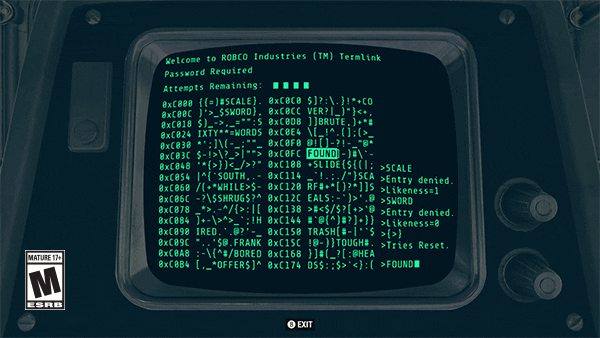

# Terminal

In this module we will see what is behind this black and white text window and how to make it a close friend!

Please follow the order of the exercises, they are arranged so that they make sense. Sometimes you can skip one and come back to it later, reach out to your coach to be sure. ;)

Enjoy your travel!

The Windows Icon () was made by _Alpár-Etele Méder_ on [iconfinder.com](iconfinder.com)
